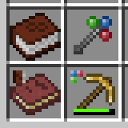

## MorphOverlay
An client-side addon for Akashic Tome and Morph-O-Tool that displays a mark on morphed items, to help players find those items.  
By default, it shows colors on corners for the items morphed from those items, but it can be overridden by a resourcepack for this mod.  
